# MBA_MLOPS

# 🗂️ Projeto QuantumFinance — Score de Crédito

Este repositório contém a estrutura base para o desenvolvimento do sistema de Score de Crédito **QuantumFinance**, alinhado às práticas de MLOps e reprodutibilidade.

---

## 📌 **Visão Geral**

- Estrutura organizada com `DevContainer` para garantir ambiente de desenvolvimento isolado.
- Versionamento de dados e modelos com **DVC** e **MinIO** (substitui S3).
- API segura implementada com **FastAPI**, autenticação e throttling.
- Frontend interativo com **Streamlit**.
- Rastreamento de experimentos com **MLflow**.
- Versionamento de código com **Git/GitHub**.

---

## 🗺️ **Arquitetura do Projeto**

A arquitetura geral do sistema está representada no diagrama abaixo:




**⚠️ Observação:**  
> 🔒 Este caminho é **local** e estático:
> `C:\Users\wilso\MBA_MLOPS\desenvolvimento\arquitetura.svg`  
> Lembre-se de incluir a versão final do diagrama dentro da pasta `/docs` do repositório remoto ou configurar para que fique acessível via URL do GitHub Pages, se desejar.

---

## ⚙️ **Estrutura Recomendada**

```plaintext
📁 projeto/
 ├── .devcontainer/         # Configuração do ambiente VSCode
 ├── data/                  # Dados versionados via DVC
 ├── notebooks/             # Notebooks de EDA e pré-processamento
 ├── src/                   # Código-fonte da API e scripts
 ├── models/                # Modelos treinados
 ├── Streamlit/             # Aplicação frontend
 ├── docs/arquitetura.svg   # Diagrama renderizado para documentação
 ├── README.md              # Este arquivo
 └── docker-compose.yml     # Orquestração local
