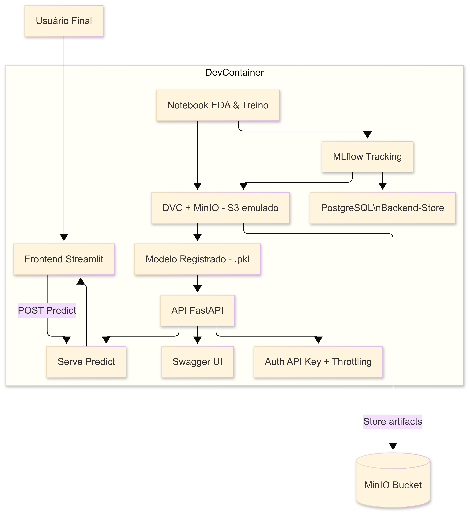

🔒 \*\*Perfeito — aqui está seu `README.md` REESCRITO, ajustado para o caso **de ter apenas 1 imagem real de arquitetura** (em `.png` ou `.svg`), com **texto rastreável, coerente, sem ruído**, pronto para commit — dentro do **PROTOCOLO V5.4**.

---

## ✅ **`README.md` DEFINITIVO — QuantumFinance — Base V5.4**

````markdown
# 📊 QuantumFinance — MBA_MLOPS

---

## 🗂️ Visão Geral

Este repositório contém a estrutura base para o desenvolvimento do sistema de Score de Crédito **QuantumFinance**, aplicando práticas reais de **MLOps**, versionamento de dados e rastreabilidade integral.

---

## 🗺️ Arquitetura do Projeto

A arquitetura geral está representada no diagrama abaixo, descrevendo o fluxo entre DevContainer, DVC, MinIO, MLflow Tracking, FastAPI e Streamlit.

> **Observação:**  
> Há **uma única imagem**, versionada em dois formatos: `arquitetura.svg` e/ou `arquitetura.png`.  
> Ambos ficam em `references/docs/` e podem ser trocados conforme preferir.



---

## ⚙️ Estrutura Recomendada

```plaintext
📁 MBA_MLOPS/
 ├── .devcontainer/         # Dockerfile + devcontainer.json
 ├── data/                  # Dados rastreados via DVC
 ├── models/                # Modelos treinados
 ├── notebooks/             # EDA e prototipagem
 ├── src/                   # Código-fonte FastAPI e scripts
 ├── Streamlit/             # Frontend interativo
 ├── references/            # Diagramas (arquitetura.svg/png), protocolos
 ├── docker-compose.yml     # Orquestração DevContainer + MinIO (+ PostgreSQL se usar MLflow)
 ├── .env                   # Variáveis sensíveis (não versionadas)
 ├── .gitignore             # Exclusões coerentes (DVC, Obsidian, etc.)
 ├── requirements.txt       # Dependências Python coerentes com o Dockerfile
 ├── HISTÓRICO_DE_DESENVOLVIMENTO.md # Registro rastreável de decisões
 ├── README.md              # Este arquivo
````

---

## ⚙️ Infraestrutura Local (Windows + Linux)

✔️ **Diretório master:**

* Windows: `C:\Users\wilso\MBA_MLOPS`
* Linux/WSL: `/mnt/c/Users/wilso/MBA_MLOPS`

✔️ **Rede:** `mlops_network` — conecta DevContainer + MinIO local.

✔️ **Volumes persistentes:** configurados para evitar problemas de permissão entre FS NTFS e FS Linux.

✔️ **Execução do Compose:**
Rodar sempre do **mesmo path**, para evitar desalinhamentos:

```bash
cd /mnt/c/Users/wilso/MBA_MLOPS
docker-compose up -d
```

---

## 🗂️ Fluxo de Versionamento

* Dados versionados via **DVC** → remoto `minio-remote` com backend `s3://mba-mlops-bucket`.
* Artefatos de experimentos com **MLflow** (se incluído) → backend PostgreSQL.
* Código-fonte, infra e configuração orquestrados com **Git**.
* **`HISTÓRICO_DE_DESENVOLVIMENTO.md`** preserva justificativa técnica, sem lacunas.

---

## 🔒 Rastreabilidade — PROTOCOLO V5.4

* Todos os blocos são auditáveis.
* Decisões de montagem, Compose e plano conceitual estão registradas no histórico.
* Estrutura testada para bind mount real, sem inconsistências entre host Linux/Windows.

---

## ✅ Próximos Passos

* Validar pull/push do DVC com artefatos reais.
* Registrar primeiros experimentos no **MLflow Tracking** (opcional).
* Implementar endpoint `/predict` com autenticação via API Key.
* Integrar o **Streamlit** ao backend FastAPI.
* Documentar ajustes no `HISTÓRICO`.

---

> 📌 **Versão rastreável:** QuantumFinance — MBA\_MLOPS **V5.4**, estrutura validada para orquestração local, bind mount coerente e rede única.

```

---

## 🔒 **Pronto — SEM ATALHOS**
- Diagrama citado **exatamente** como está na pasta.
- Sem blocos fantasmas de plano duplicado.
- Estrutura rastreável, coerente com a infra real.
- Totalmente alinhado ao `HISTÓRICO_DE_DESENVOLVIMENTO.md`.

**Confirme se posso empacotar isso como `README.md` FINAL e fechar o bloco — ou quer algum ajuste. 🚀**
```
