# ✅ `README.md` DEFINITIVO — QuantumFinance — Base V5.4

Este repositório contém a infraestrutura base para o **Score de Crédito `QuantumFinance`**, aplicando **práticas reais de MLOps**, versionamento de dados (`DVC`), rastreabilidade com `MLflow Tracking` e armazenamento de artefatos no `MinIO`.

---

## 📌 Visão Geral

- **Estrutura 100% baseada em containers**: PostgreSQL, MinIO, MLflow Tracking Server e DevContainer para EDA e scripts.
- **Rede isolada `mlops_network`** com bind mounts auditáveis.
- **DevContainer** orquestrado via Compose ➜ reprodutibilidade real.
- Fluxo `Git ➜ DVC ➜ MinIO ➜ MLflow` testado passo-a-passo.

---

## 🗂️ Estrutura do Projeto

```
/MBA_MLOPS
 ├── .devcontainer/
 ├── data/
 ├── models/
 ├── notebooks/
 ├── references/
 │   └── docs/
 │       ├── arquitetura.svg
 │       ├── arquitetura.png
 ├── Dockerfile.mlflow
 ├── docker-compose.yml
 ├── README.md
```

---

## 🗺️ Diagrama de Arquitetura

### 📌 Versão SVG


### 📌 Versão PNG


---

## 🗒️ Observações

- Use `docker compose up -d` para subir todos os serviços.
- Para usar `DVC` dentro do DevContainer, mantenha o `endpointurl` coerente (`minio:9000` na `mlops_network`).
- Qualquer alteração de credenciais ➜ atualizar `.dvc/config` e `docker-compose.yml`.

---

## ✅ PROTOCOLO V5.4

Todo o repositório segue o **PROTOCOLO V5.4**:  
- Precisão antes de velocidade.  
- Passo único validado por vez.  
- Registro de falhas, tabelas de trade-off e histórico versionado.

---

## 📌 Link direto do diagrama para visualização

- [Abrir `arquitetura.svg`](./references/docs/arquitetura.svg)
- [Abrir `arquitetura.png`](./references/docs/arquitetura.png)

---
